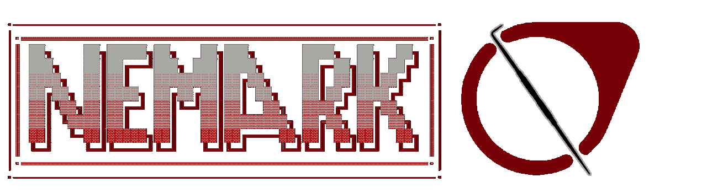

<h1><b>A FREE and Open-Source 3D SDK / Game engine</b></h1>

>[!Note]
> Nemark is not a finished project yet and at the time it is not functional yet!

##
### Instalation from source
Linux Arch:
```bash
sudo pacman -S glfw cmake
```
Linux Ubuntu:
```bash
sudo apt-get install libglfw3 cmake
```
Linux Fedora:
```bash
sudo dnf install glfw cmake
```
FreeBSD:
```bash
sudo pkg install glfw cmake
```
Windows - GLFW included in project already and CMake must be installed manually.
##
### Building from source

Setting up build:
```bash
cmake -B build
```
Building:
```bash
cmake --build build
```
Running:

BSD/MacOS/Linux: (Depends on the compiler but usually this works.)
```bash
./build/[EXECUTABLE_NAME_HERE]
```
Windows: (Depends on compiler but if youre using MSVC do this.)
```bash
.\build\Debug\[EXECUTABLE_NAME_HERE]
```